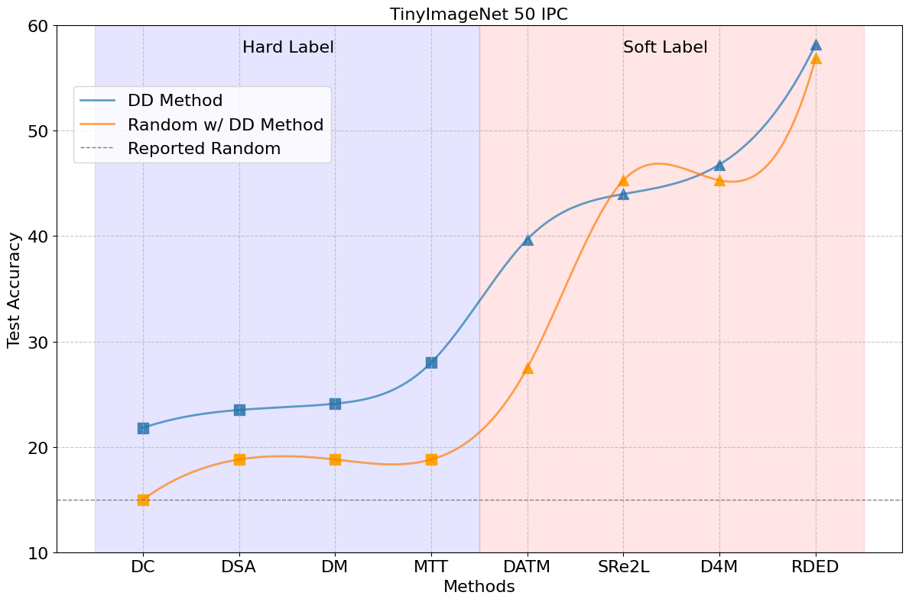

# <center>DD-Ranking: Rethinking the Evaluation of Dataset Distillation</center>

<p align="center">
  <picture>
  <!-- Dark theme logo -->
    <source media="(prefers-color-scheme: dark)" srcset="static/logo.png">
    <!-- Light theme logo -->
    
  </picture>
</p>

<!-- <h3 align="center">
Fair and benchmark for dataset distillation.
</h3> -->
<p align="center">
| <a href="https://nus-hpc-ai-lab.github.io/DD-Ranking/"><b>Documentation</b></a> | <a href="https://huggingface.co/spaces/logits/DD-Ranking"><b>Leaderboard</b></a> | <a href=""><b>Paper </b> (Coming Soon)</a> | <a href="https://x.com/Richard91316073/status/1890296645486801230"><b>Twitter/X</b></a> | <a href="https://join.slack.com/t/dd-ranking/shared_invite/zt-2xlcuq1mf-hmVcfrtqrIB3qXRjwgB03A"><b>Developer Slack</b></a> |
</p>


---

*Latest News* 🔥

[Latest] We have fixed some bugs and released a new version of DD-Ranking. Please update your package via `pip install ddranking --upgrade`.

<details>
<summary>Unfold to see more details.</summary>
<br>

- [2025/02] We have fixed some bugs and released a new version of DD-Ranking. Please update your package via `pip install ddranking --upgrade`.

- [2025/01] Our PyPI package is officially released! Users can now install DD-Ranking via `pip install ddranking`.

- [2024/12/28] We officially released DD-Ranking! DD-Ranking provides us a new benchmark decoupling the impacts from knowledge distillation and data augmentation.
</details>

---

## Motivation: DD Lacks an Evaluation Benchmark

<details>
<summary>Unfold to see more details.</summary>
<br>
Dataset Distillation (DD) aims to condense a large dataset into a much smaller one, which allows a model to achieve comparable performance after training on it. DD has gained extensive attention since it was proposed. With some foundational methods such as DC, DM, and MTT, various works have further pushed this area to a new standard with their novel designs.



Notebaly, more and more methods are transitting from "hard label" to "soft label" in dataset distillation, especially during evaluation. **Hard labels** are categorical, having the same format of the real dataset. **Soft labels** are outputs of a pre-trained teacher model. 
Recently, Deng et al., pointed out that "a label is worth a thousand images". They showed analytically that soft labels are exetremely useful for accuracy improvement. 

However, since the essence of soft labels is **knowledge distillation**, we find that when applying the same evaluation method to randomly selected data, the test accuracy also improves significantly (see the figure above).

This makes us wonder: **Can the test accuracy of the model trained on distilled data reflect the real informativeness of the distilled data?**

Additionally, we have discoverd unfairness of using only test accuracy to demonstrate one's performance from the following three aspects:
1. Results of using hard and soft labels are not directly comparable since soft labels introduce teacher knowledge.
2. Strategies of using soft labels are diverse. For instance, different objective functions are used during evaluation, such as soft Cross-Entropy and Kullback–Leibler divergence. Also, one image may be mapped to one or multiple soft labels.
3. Different data augmentations are used during evaluation.

Motivated by this, we propose DD-Ranking, a new benchmark for DD evaluation. DD-Ranking provides a fair evaluation scheme for DD methods that can decouple the impacts from knowledge distillation and data augmentation to reflect the real informativeness of the distilled data.

</details>

## Introduction

<details>
<summary>Unfold to see more details.</summary>
<br>
DD-Ranking (DD, *i.e.*, Dataset Distillation) is an integrated and easy-to-use benchmark for dataset distillation. It aims to provide a fair evaluation scheme for DD methods that can decouple the impacts from knowledge distillation and data augmentation to reflect the real informativeness of the distilled data.

<!-- Hard label is tested -->
<!-- Keep the same compression ratio, comparing with random selection -->
### Benchmark

Revisit the original goal of dataset distillation: 
> The idea is to synthesize a small number of data points that do not need to come from the correct data distribution, but will, when given to the learning algorithm as training data, approximate the model trained on the original data. (Wang et al., 2020)
>

The evaluation method for DD-Ranking is grounded in the essence of dataset distillation, aiming to better reflect the informativeness of the synthesized data by assessing the following two aspects:  
1. The degree to which the real dataset is recovered under hard labels (hard label recovery): $\text{HLR}=\text{Acc.}{\text{real-hard}}-\text{Acc.}{\text{syn-hard}}$.  

2. The improvement over random selection when using personalized evaluation methods (improvement over random): $\text{IOR}=\text{Acc.}{\text{syn-any}}-\text{Acc.}{\text{rdm-any}}$.
$\text{Acc.}$ is the accuracy of models trained on different samples. Samples' marks are as follows:
- $\text{real-hard}$: Real dataset with hard labels;
- $\text{syn-hard}$: Synthetic dataset with hard labels;
- $\text{syn-any}$: Synthetic dataset with personalized evaluation methods (hard or soft labels);
- $\text{rdm-any}$: Randomly selected dataset (under the same compression ratio) with the same personalized evaluation methods.

DD-Ranking uses a weight sum of $\text{IOR}$ and $-\text{HLR}$ to rank different methods:
$\alpha = w\text{IOR}-(1-w)\text{HLR}, \quad w \in [0, 1]$

Formally, the **DD-Ranking Score (DDRS)** is defined as:
$(e^{\alpha}-e^{-1}) / (e - e^{-1})$

By default, we set $w = 0.5$ on the leaderboard, meaning that both $\text{IOR}$ and $\text{HLR}$ are equally important. Users can adjust the weights to emphasize one aspect on the leaderboard.

</details>

## Overview

DD-Ranking is integrated with:
- Multiple [strategies](https://github.com/NUS-HPC-AI-Lab/DD-Ranking/tree/main/dd_ranking/loss) of using soft labels in existing works;
- Commonly used [data augmentation](https://github.com/NUS-HPC-AI-Lab/DD-Ranking/tree/main/dd_ranking/aug) methods in existing works;
- Commonly used [model architectures](https://github.com/NUS-HPC-AI-Lab/DD-Ranking/blob/main/dd_ranking/utils/networks.py) in existing works.

DD-Ranking has the following features:
- **Fair Evaluation**: DD-Ranking provides a fair evaluation scheme for DD methods that can decouple the impacts from knowledge distillation and data augmentation to reflect the real informativeness of the distilled data.
- **Easy-to-use**: DD-Ranking provides a unified interface for dataset distillation evaluation.
- **Extensible**: DD-Ranking supports various datasets and models.
- **Customizable**: DD-Ranking supports various data augmentations and soft label strategies.

DD-Ranking currently includes the following datasets and methods (categorized by hard/soft label). Our replication of the following baselines can be found at the [methods](https://github.com/NUS-HPC-AI-Lab/DD-Ranking/tree/methods) branch. Evaluation results can be found in the [leaderboard](https://huggingface.co/spaces/Soptq/DD-Ranking) and evaluation configurations can be found at the [eval](https://github.com/NUS-HPC-AI-Lab/DD-Ranking/tree/eval) branch.

|Supported Dataset|Evaluated Hard Label Methods|Evaluated Soft Label Methods|
|:-|:-|:-|
|CIFAR-10|DC|DATM|
|CIFAR-100|DSA|SRe2L|
|TinyImageNet|DM|RDED|
||MTT|D4M|


## Tutorial

Install DD-Ranking with `pip` or from [source](https://github.com/NUS-HPC-AI-Lab/DD-Ranking/tree/main):

### Installation

From pip

```bash
pip install ddranking
```

From source

```bash
python setup.py install
```
### Quickstart

Below is a step-by-step guide on how to use our `dd_ranking`. This demo is based on soft labels (source code can be found in `demo_soft.py`). You can find hard label demo in `demo_hard.py`.

**Step1**: Intialize a soft-label metric evaluator object. Config files are recommended for users to specify hyper-parameters. Sample config files are provided [here](https://github.com/NUS-HPC-AI-Lab/DD-Ranking/tree/main/configs).

```python
from ddranking.metrics import SoftLabelEvaluator
from ddranking.config import Config

config = Config.from_file("./configs/Demo_Soft_Label.yaml")
soft_label_metric_calc = SoftLabelEvaluator(config)
```

<details>
<summary>You can also pass keyword arguments.</summary>

```python
device = "cuda"
method_name = "DATM"                    # Specify your method name
ipc = 10                                # Specify your IPC
dataset = "CIFAR10"                     # Specify your dataset name
syn_data_dir = "./data/CIFAR10/IPC10/"  # Specify your synthetic data path
real_data_dir = "./datasets"            # Specify your dataset path
model_name = "ConvNet-3"                # Specify your model name
teacher_dir = "./teacher_models"		# Specify your path to teacher model chcekpoints
im_size = (32, 32)                      # Specify your image size
dsa_params = {                          # Specify your data augmentation parameters
    "prob_flip": 0.5,
    "ratio_rotate": 15.0,
    "saturation": 2.0,
    "brightness": 1.0,
    "contrast": 0.5,
    "ratio_scale": 1.2,
    "ratio_crop_pad": 0.125,
    "ratio_cutout": 0.5
}
save_path = f"./results/{dataset}/{model_name}/IPC{ipc}/dm_hard_scores.csv"

""" We only list arguments that usually need specifying"""
soft_label_metric_calc = SoftLabelEvaluator(
    dataset=dataset,
    real_data_path=real_data_dir, 
    ipc=ipc,
    model_name=model_name,
    soft_label_criterion='sce',  # Use Soft Cross Entropy Loss
    soft_label_mode='S',         # Use one-to-one image to soft label mapping
    data_aug_func='dsa',         # Use DSA data augmentation
    aug_params=dsa_params,       # Specify dsa parameters
    im_size=im_size,
    stu_use_torchvision=False,
    tea_use_torchvision=False,
    teacher_dir='./teacher_models',
    device=device,
    save_path=save_path
)
```
</details>

For detailed explanation for hyper-parameters, please refer to our <a href="">documentation</a>.

**Step 2:** Load your synthetic data, labels (if any), and learning rate (if any).

```python
syn_images = torch.load('/your/path/to/syn/images.pt')
# You must specify your soft labels if your soft label mode is 'S'
soft_labels = torch.load('/your/path/to/syn/labels.pt')
syn_lr = torch.load('/your/path/to/syn/lr.pt')
```

**Step 3:** Compute the metric.

```python
metric = soft_label_metric_calc.compute_metrics(image_tensor=syn_images, soft_labels=soft_labels, syn_lr=syn_lr)
# alternatively, you can specify the image folder path to compute the metric
metric = soft_label_metric_calc.compute_metrics(image_path='./your/path/to/syn/images', soft_labels=soft_labels, syn_lr=syn_lr)
```

The following results will be returned to you:
- `HLR mean`: The mean of hard label recovery over `num_eval` runs.
- `HLR std`: The standard deviation of hard label recovery over `num_eval` runs.
- `IOR mean`: The mean of improvement over random over `num_eval` runs.
- `IOR std`: The standard deviation of improvement over random over `num_eval` runs.

Check out our <span style="color: #ff0000;">[documentation](https://nus-hpc-ai-lab.github.io/DD-Ranking/)</span> to learn more.

## Coming Soon

- [ ] Evaluation results on ImageNet subsets.
- [ ] More baseline methods.
- [ ] DD-Ranking scores that decouple the impacts from data augmentation.

## Contributing

<!-- Only PR for the 1st version of DD-Ranking -->
Feel free to submit grades to update the DD-Ranking list. We welcome and value any contributions and collaborations.
Please check out [CONTRIBUTING.md](./CONTRIBUTING.md) for how to get involved.


## Technical Members:
- [Zekai Li*](https://lizekai-richard.github.io/) (National University of Singapore)
- [Xinhao Zhong*](https://ndhg1213.github.io/) (National University of Singapore)
- [Zhiyuan Liang](https://jerryliang24.github.io/) (University of Science and Technology of China)
- [Yuhao Zhou](https://github.com/Soptq) (Sichuan University)
- [Mingjia Shi](https://bdemo.github.io/homepage/) (Sichuan University)
- [Dongwen Tang](https://scholar.google.com/citations?user=9lKm_5IAAAAJ) (Xidian University)
- [Ziqiao Wang](https://www.linkedin.com/in/ziqiao-wang-95a4b232b?trk=contact-info) (National University of Singapore)
- [Wangbo Zhao](https://wangbo-zhao.github.io/) (National University of Singapore)
- [Xuanlei Zhao](https://oahzxl.github.io/) (National University of Singapore)
- [Haonan Wang](https://charles-haonan-wang.me/) (National University of Singapore)
- [Ziheng Qin](https://henryqin1997.github.io/ziheng_qin/) (National University of Singapore)
- [Dai Liu](https://scholar.google.com/citations?user=3aWKpkQAAAAJ&hl=en) (Munich Technology University)
- [Kaipeng Zhang](https://kpzhang93.github.io/) (Shanghai AI Lab)
- [Tianyi Zhou](https://joeyzhouty.github.io/) (A*STAR)
- [Zheng Zhu](http://www.zhengzhu.net/) (Tsinghua University)
- [Kun Wang](https://www.kunwang.net/) (University of Science and Technology of China)
- [Guang Li](https://www-lmd.ist.hokudai.ac.jp/member/guang-li/) (Hokkaido University)
- [Junhao Zhang](https://junhaozhang98.github.io/) (National University of Singapore)
- [Jiawei Liu](https://jia-wei-liu.github.io/) (National University of Singapore)
- [Yiran Huang](https://www.eml-munich.de/people/yiran-huang) (Technical University of Munich)
- [Lingjuan Lyu](https://sites.google.com/view/lingjuan-lyu) (Sony)
- [Jiancheng Lv](https://scholar.google.com/citations?user=0TCaWKwAAAAJ&hl=en) (Sichuan University)
- [Yaochu Jin](https://en.westlake.edu.cn/faculty/yaochu-jin.html) (Westlake University)
- [Zeynep Akata](https://www.eml-munich.de/people/zeynep-akata) (Technical University of Munich)
- [Jindong Gu](https://jindonggu.github.io/) (Oxford University)
- [Rama Vedantam](https://ramavedantam.com/) (Independent Researcher)
- [Mike Shou](https://sites.google.com/view/showlab) (National University of Singapore)
- [Zhiwei Deng](https://lucas2012.github.io/) (Google DeepMind)
- [Yan Yan](https://tomyan555.github.io/) (University of Illinois at Chicago)
- [Yuzhang Shang](https://42shawn.github.io/) (University of Illinois at Chicago)
- [George Cazenavette](https://georgecazenavette.github.io/) (Massachusetts Institute of Technology)
- [Xindi Wu](https://xindiwu.github.io/) (Princeton University)
- [Justin Cui](https://scholar.google.com/citations?user=zel3jUcAAAAJ&hl=en) (UC Los Angeles)
- [Tianlong Chen](https://tianlong-chen.github.io/) (UNC Chapel Hill)
- [Angela Yao](https://www.comp.nus.edu.sg/~ayao/) (National University of Singapore)
- [Baharan Mirzasoleiman](https://baharanm.github.io/) (UC Los Angeles)
- [Manolis Kellis](https://web.mit.edu/manoli/) (Massachusetts Institute of Technology)
- [Konstantinos N. Plataniotis](https://www.comm.utoronto.ca/~kostas/) (University of Toronto)
- [Bo Zhao](https://www.bozhao.me/) (Shanghai Jiao Tong University)
- [Hakan Bilen](https://homepages.inf.ed.ac.uk/hbilen/) (University of Edinburgh)
- [Zhangyang Wang](https://vita-group.github.io/) (UT Austin)
- [Yang You](https://www.comp.nus.edu.sg/~youy/) (National University of Singapore)
- [Kai Wang](https://kaiwang960112.github.io/) (National University of Singapore)

\* *equal contribution*

## License

DD-Ranking is released under the MIT License. See [LICENSE](./LICENSE) for more details.

## Related Works

- [Dataset Distillation](https://arxiv.org/abs/1811.10959), Wang et al., in arXiv 2018.
- [Dataset Condensation with Gradient Matching](https://arxiv.org/abs/2006.05929), Zhao et al., in ICLR 2020.
- [Dataset Condensation with Differentiable Siamese Augmentation](https://arxiv.org/abs/2102.08259), Zhao \& Bilen, in ICML 2021.
- [Dataset Distillation via Matching Training Trajectories](https://arxiv.org/abs/2203.11932), Cazenavette et al., in CVPR 2022.
- [Dataset Distillation with Distribution Matching](https://arxiv.org/abs/2110.04181), Zhao \& Bilen, in WACV 2023.
- [Squeeze, Recover and Relabel: Dataset Condensation at ImageNet Scale From A New Perspective](https://arxiv.org/abs/2306.13092), Yin et al., in NeurIPS 2023.
- [Towards Lossless Dataset Distillation via Difficulty-Aligned Trajectory Matching](https://arxiv.org/abs/2310.05773), Guo et al., in ICLR 2024.
- [On the Diversity and Realism of Distilled Dataset: An Efficient Dataset Distillation Paradigm](https://arxiv.org/abs/2312.03526), Sun et al., in CVPR 2024.
- [D4M: Dataset Distillation via Disentangled Diffusion Model](https://arxiv.org/abs/2407.15138), Su et al., in CVPR 2024.


## Reference

If you find DD-Ranking useful in your research, please consider citing the following paper:

```bibtex
@misc{li2024ddranking,
  title = {DD-Ranking: Rethinking the Evaluation of Dataset Distillation},
  author = {Li, Zekai and Zhong, Xinhao and Liang, Zhiyuan and Zhou, Yuhao and Shi, Mingjia and Wang, Ziqiao and Zhao, Wangbo and Zhao, Xuanlei and Wang, Haonan and Qin, Ziheng and Liu, Dai and Zhang, Kaipeng and Zhou, Tianyi and Zhu, Zheng and Wang, Kun and Li, Guang and Zhang, Junhao and Liu, Jiawei and Huang, Yiran and Lyu, Lingjuan and Lv, Jiancheng and Jin, Yaochu and Akata, Zeynep and Gu, Jindong and Vedantam, Rama and Shou, Mike and Deng, Zhiwei and Yan, Yan and Shang, Yuzhang and Cazenavette, George and Wu, Xindi and Cui, Justin and Chen, Tianlong and Yao, Angela and Kellis, Manolis and Plataniotis, Konstantinos N. and Zhao, Bo and Wang, Zhangyang and You, Yang and Wang, Kai},
  year = {2024},
  howpublished = {GitHub repository},
  url = {https://github.com/NUS-HPC-AI-Lab/DD-Ranking}
}
```
